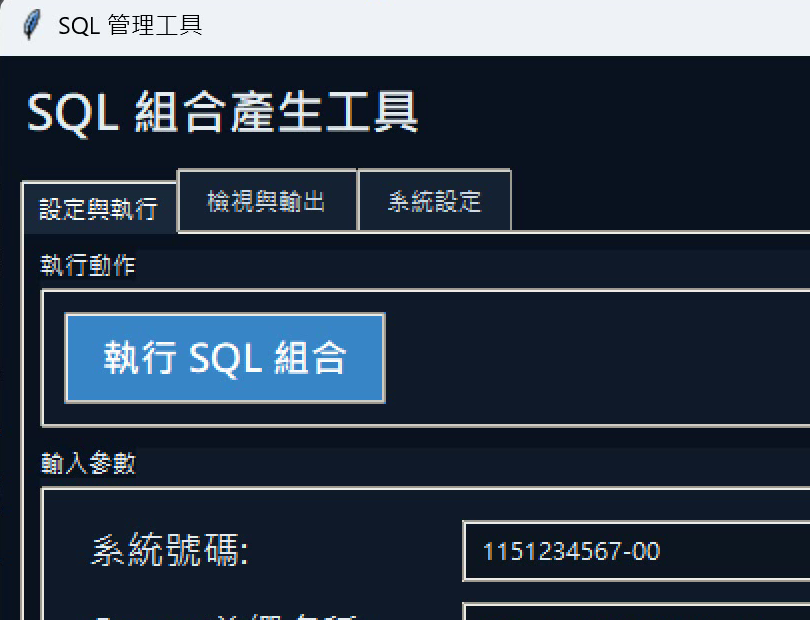

# LD Query SQL GUI

`ld-query-sql-gui` 是一個用 Python 製作的 SQL 產生工具。  
用途是把「原始 SQL」套進 `ManagerSql.sql` 模板，輸出可交付的管理 SQL 檔，並提供 GUI / CLI 兩種操作方式。

## 這個工具在做什麼（摘要）

- 輸入系統號碼、Query Template、SQL 來源與模板檔
- 將原始 SQL 轉為 `to_clob(...)` 並套入 `ManagerSql.sql`
- 產出可交付 SQL 檔到 `data/output/`
- 提供三種 SQL 檢視：原始 SQL、模板渲染後 SQL、日期替換測試 SQL
- 支援一鍵複製、另存 `.sql`、系統設定保存與啟動路徑管理

## 畫面預覽



## 這個工具在做什麼

- 管理系統 Query SQL 產生流程（模板渲染、輸出檔產生、衝突處理）
- 提供 SQL 編輯與預覽（原始 / 模板渲染後 / 日期替換測試）
- 支援語法亮度、複製內容、另存 SQL
- 支援 `settings.json`（本機）設定保存（含根目錄、Python 路徑、字體大小）
- 支援輸出前基本驗證（必填欄位、檔案存在性）

## 快速開始

使用 Python 3.11 以上，GUI 需要 Python 的 Tkinter。核心產生流程與測試只使用標準函式庫。

### 1) GUI（Windows）

```bat
run_ld_query_sql_gui.bat
```

啟動檔優先使用 `settings.json` 的 `python_exe`；未指定時依序使用 `py -3`、`python`，不再依賴個人電腦的固定路徑。

或

```bash
python gui.py
```

### 2) CLI

```bash
python -m ld_query_sql_tool.cli --help
```

範例：

```bash
python -m ld_query_sql_tool.cli ^
  --oa-no 1151234567-00 ^
  --query-template 001-ph-LDOOOO_Update ^
  --sql-source-mode file ^
  --sql-file data/input/source.sql ^
  --save-settings
```

## 設定檔（settings.json）

- 版本庫提供 `settings.example.json` 作為範本
- 執行時請用本機 `settings.json`（已加入 `.gitignore`，不會上傳個人路徑）

重點欄位：

- `root_dir`: 路徑基準目錄（建議 `.`，即專案根目錄）
- `output_dir`, `sql_file`, `title_file`, `template_file`: 可用相對於 `root_dir` 的路徑
- `python_exe`: 啟動用 Python 路徑（可在系統設定頁測試）
- `sql_source_mode`: `file` 或 `inline`
- `overwrite_mode`: `prompt` / `overwrite` / `rename` / `error`

相對的 `root_dir` 一律以專案根目錄為基準，與目前工作目錄及設定檔位置無關。指定自訂設定檔只會儲存該檔，不會同步覆蓋預設 `settings.json`。CLI 的 `--save-settings` 僅在 SQL 產生成功後回存。

## 日期替換說明

- 第一頁輸入的日期是「測試替換」用途
- `日期替換` 分頁會將 SQL 內的 `startDate` / `endDate`（含 `?startDate?` 類型）替換後顯示
- PRD 腳本可保留 placeholder，不會強制寫死日期

支援 `${startDate}`、`:startDate`、`?startDate?`、獨立的 `startDate`，結束日期同理。`startDateColumn` 等較長識別字不會被修改。兩個日期可同時留空；提供時須為有效的 `YYYY-MM-DD`，且開始日期不可晚於結束日期。

## SQL 輸出與檔案安全

- CLOB 維持每 10 行分段，長行會再依跳脫後 UTF-8 內容切成最多 4,000 位元組的字串，保留原始換行與 Unicode 字元。
- 範本占位符只替換一次；來源 SQL 或描述中同名的 `${author}` 等文字會保留。
- SQL 與設定檔先完整寫入同目錄暫存檔，再發布；寫入或覆寫失敗會保留既有檔案。
- `error` 與 `rename` 使用原子硬連結發布，並行執行不會搶占同名檔案。需使用支援硬連結的檔案系統，例如 NTFS；不支援時會明確失敗，可改用支援的本機磁碟。
- SQL 產生流程禁止覆蓋來源 SQL、欄位檔或範本，包含其硬連結。
- 日誌寫入失敗會顯示警告，SQL 產生結果仍會正確回報。GUI 設定回存失敗也會顯示警告；CLI 指定回存失敗時會回傳結束碼 `1` 並告知 SQL 已產生。

Oracle 位元組限制參考：[Oracle Database 19c — Literals](https://docs.oracle.com/en/database/oracle/oracle-database/19/sqlrf/Literals.html)。分段以 UTF-8 / AL32UTF8 為基準；其他資料庫字元集須另行確認。

## 專案結構

```text
.
├─ gui.py                         # 根目錄 GUI 啟動入口
├─ run_ld_query_sql_gui.bat       # Windows 啟動入口
├─ settings.example.json          # 設定檔範本（可複製成 settings.json）
├─ ld_query_sql_tool/             # 核心程式
├─ data/
│  ├─ input/
│  ├─ output/
│  └─ templates/
├─ tests/
└─ docs/
```

## 開發與測試

語法檢查：

```bash
python -m compileall -q ld_query_sql_tool gui.py tests
```

單元測試（包含不需顯示器的 GUI 流程測試）：

```bash
python -m unittest discover -s tests -v
```

本次 code review、修正範圍及實測限制見 [docs/code-review-20261004.md](docs/code-review-20261004.md)。Windows 啟動檔與實際 Tk 視窗仍需在 Windows 上人工驗收，Oracle 執行也需在目標資料庫驗證。

## 畫面錄製（Windows）

目前工具本身不含內建錄影功能，建議使用 Windows 內建錄製：

### 方法 1：Xbox Game Bar（最快）

1. 開啟 GUI 後按 `Win + G`
2. 在「擷取」面板按錄製（或 `Win + Alt + R`）
3. 操作你要展示的流程
4. 再按一次 `Win + Alt + R` 停止
5. 影片預設在：`影片\擷取`

### 方法 2：Snipping Tool（Windows 11）

1. 開啟「剪取工具」
2. 切到「錄製」模式
3. 選取視窗範圍後開始錄製
4. 結束後另存 `mp4`

### 方法 3：Python 腳本錄製（本專案）

先安裝套件：

```bash
pip install mss opencv-python numpy
```

錄製 20 秒全螢幕：

```bash
python scripts/record_gui.py --seconds 20 --output docs/assets/gui-demo.mp4
```

錄製指定區域（x=200,y=120,width=1400,height=900）：

```bash
python scripts/record_gui.py --seconds 20 --x 200 --y 120 --width 1400 --height 900 --output docs/assets/gui-demo.mp4
```
